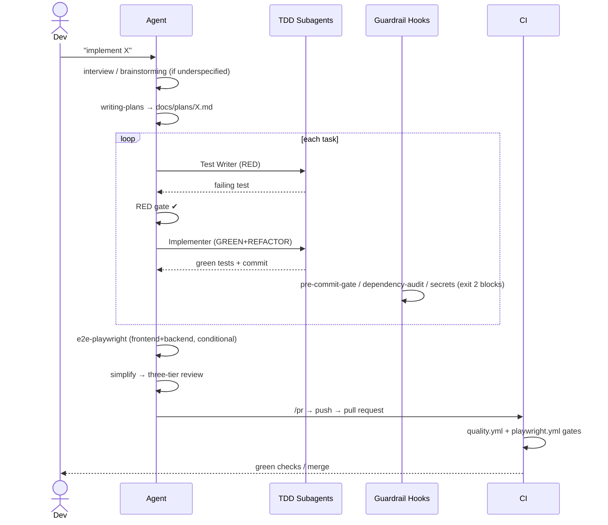
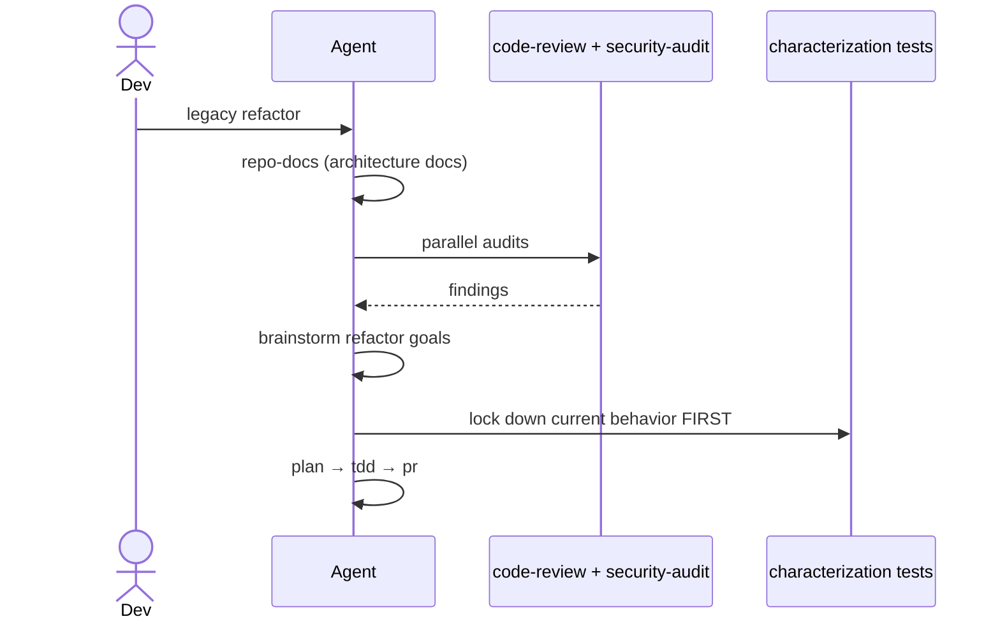
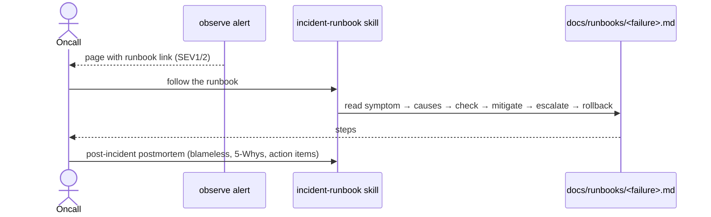
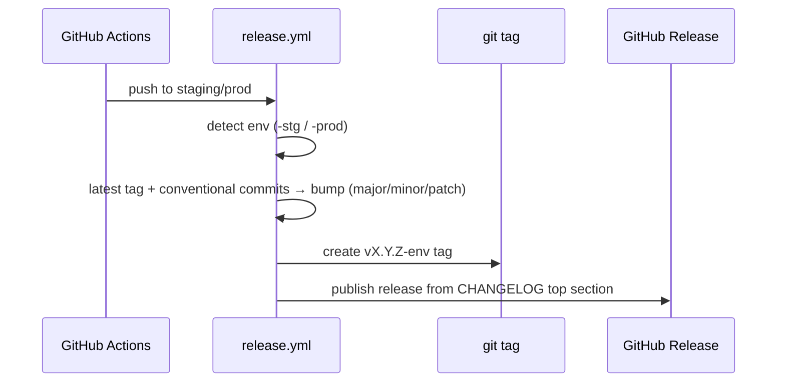

# Workflows — Tapway Superpowers

One section per significant workflow. These are the flows a developer (or agent)
goes through when using the plugin, plus the flows the plugin itself runs.

## Workflow: Solo Feature Build (Individual Mode)

**Trigger:** Developer asks the agent to implement a feature or fix a bug
**Actor:** Developer + coding agent



**Description:**
The agent runs the strict pipeline in order — interview → brainstorm → plan →
TDD → E2E → simplify → review → PR. Hooks fire at tool-use time: a commit that
fails lint/format/typecheck/coverage, or that contains a critical dependency
vulnerability, is blocked before it happens (`exit 2` on PreToolUse).

**Edge Cases / Failure Modes:**
- Task fails twice → coordinator pauses and reports the blocker instead of pushing on.
- `/review` finds Critical issues → fixed before the PR opens.
- E2E gate skips when only docs/config changed (conditional file detection).
- A commit with failing quality gates → blocked by the hook; agent fixes and re-commits.

## Workflow: Automated Ship (autoship)

**Trigger:** "implement it with autopilot" / "ship and deploy"
**Actor:** Developer + autoship coordinator

```mermaid
sequenceDiagram
  actor Dev
  participant Coord as autoship coordinator
  participant Loop as Task loop (TDD subagents)
  participant Docs as repo-docs
  participant CI

  Dev->>Coord: autoship [deploy mode]
  Coord->>Coord: plan health check
  Loop->>Loop: per task: RED→GREEN→review
  Coord->>Docs: update docs (mandatory)
  alt deploy mode
    Coord->>Coord: detect deploy method → deploy to staging
    Coord->>Coord: health-check loop (60s)
    Coord->>Coord: run integration + E2E suites
  end
  Coord->>CI: open PR with evidence
  CI-->>Dev: gate results
```

**Description:**
Autoship runs the whole plan-to-PR loop without human intervention. Deploy mode
adds: deploy to staging, health check, and integration/E2E execution before the
PR opens — never a PR with a broken deployment.

**Edge Cases / Failure Modes:**
- Deployment fails → coordinator does NOT open the PR; reports and waits.
- Health check times out → logs last 50 lines, suggests rollback, does not PR.
- E2E gate mandatory in **standard mode** too (not just deploy mode) for
  frontend/backend changes.

## Workflow: Legacy Refactor

**Trigger:** Taking over an untested codebase
**Actor:** Developer + agent



**Description:**
Legacy mode writes **characterization tests** (capture current behavior) before
any refactor — you cannot safely change code you haven't locked down.

**Edge Cases / Failure Modes:**
- Characterization RED fails because code is too coupled to unit-test →
  decouple/extract until tests pass.
- Bulk mechanical changes (renames) → use the community `code-refactor` skill,
  but only after characterization tests exist.

## Workflow: Incident Response

**Trigger:** An alert from `observe` fires (or an incident happens)
**Actor:** On-call engineer + `incident-runbook` skill



**Description:**
Every `observe` alert links to a runbook; the `incident-runbook` skill creates
and maintains those runbooks (SEV1–4) and the blameless postmortem with owned,
dated action items.

**Edge Cases / Failure Modes:**
- Alert without a runbook → `observe` now instructs the agent to create one
  before shipping the alert.
- Postmortem blames a person → skill's hard rule forbids it (name processes/gaps).
- Suggested rollback = DB downgrade → skill forbids it (expand-contract instead).

## Workflow: Release

**Trigger:** PR merges to `staging` or `prod`
**Actor:** GitHub Actions `release.yml`



**Description:**
Semantic versioning with an environment suffix (`v1.2.3-stg` / `-prod`). The
bump is derived from conventional commits since the last tag for the same env.

**Edge Cases / Failure Modes:**
- No prior tag for the env → starts from 0.0.0 so the first conventional commit
  rolls to a sane version.
- CHANGELOG has no top section → release notes fall back to the tag title.