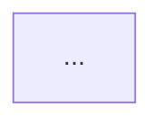
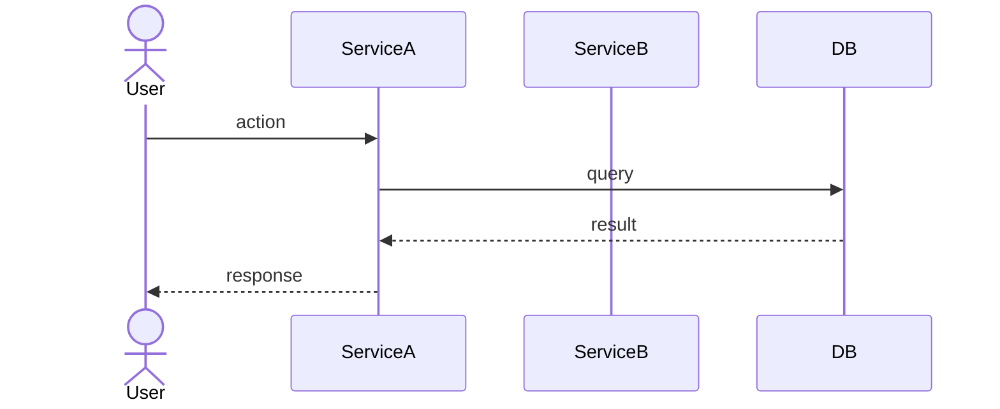

# Repo Docs Skill

Generate a standardized `docs/` folder for any repository. Every repo at Tapway
must have these documents before it is considered "production-ready" or handed off.

---

## Step 0 — Understand the Repo First

Before writing anything, do a thorough read of the codebase:

```bash
# Get the top-level layout
find . -maxdepth 3 \
  -not -path '*/node_modules/*' \
  -not -path '*/.git/*' \
  -not -path '*/dist/*' \
  -not -path '*/__pycache__/*' \
  -not -path '*/venv/*' \
  -not -path '*/.venv/*' \
  | sort

# Read key config and entry points
cat package.json 2>/dev/null || cat pyproject.toml 2>/dev/null || \
  cat requirements.txt 2>/dev/null || cat go.mod 2>/dev/null || true

cat docker-compose.yml 2>/dev/null || cat docker-compose.yaml 2>/dev/null || true
cat Dockerfile 2>/dev/null || true
cat .env.example 2>/dev/null || cat .env.sample 2>/dev/null || true
```

Read all major source files to understand:
- What the service/app does
- Its external dependencies (databases, queues, APIs, cloud services)
- Data models and schemas
- Entry points and main flows
- How it is deployed

---

## Step 1 — Create the `docs/` Folder

```bash
mkdir -p docs
```

Generate the following files. All diagrams use **Mermaid** syntax (renders natively
in GitHub, Notion, and most markdown viewers).

---

## Documents to Generate

### 1. `docs/ARCHITECTURE.md`

**Purpose:** High-level system design. Anyone joining the project must understand
the full picture from this file alone.

**Required sections:**

```markdown
# Architecture — <Repo Name>

## Overview
2–4 sentences: what this service does, who/what uses it, where it fits in the
broader SamurAI platform (edge / cloud / bridge).

## System Diagram



Show: external actors → this service → dependencies (DB, queues, external APIs,
other internal services). Label every arrow with protocol (MQTT, REST, gRPC,
WebSocket, RTSP, etc.).

## Component Breakdown
One paragraph per major internal component (module, class, worker, thread).
What it does, what it consumes, what it produces.

## Data Flow
Step-by-step numbered list of how data moves through the system for the
primary use case (e.g., camera frame → inference → event → MQTT publish).

## Key Design Decisions
Bullet list of non-obvious choices and the reasons (e.g., "Using SQS FIFO
instead of SNS fanout because ordering matters for zone transition events").

## External Dependencies
| Dependency | Type | Purpose | Notes |
|---|---|---|---|
| AWS DynamoDB | Database | ... | ... |
```

---

### 2. `docs/DB_SCHEMA.md`

**Only generate this file if the service has a database, ORM models, or
persistent storage.** Skip entirely (do not create the file) if the service
is stateless or purely passes data through.

**Required sections:**

```markdown
# Database Schema — <Repo Name>

## Storage Technology
State what database(s) are used: DynamoDB, PostgreSQL, Redis, SQLite, etc.
Include the AWS region / connection context if relevant.

## Entity Relationship Diagram

```mermaid
erDiagram
  TABLE_NAME {
    type field_name PK
    type field_name
    ...
  }
  TABLE_NAME ||--o{ OTHER_TABLE : "relationship"
```

## Table / Collection Definitions

For each table/collection/index:

### `table_name`
| Field | Type | Key | Description |
|---|---|---|---|
| id | String | PK | UUID v4 |
| ... | | | |

**Access patterns:** (for DynamoDB especially)
- List the query patterns this table supports

**Notes:** Any TTL, GSI, LSI, or special indexing to call out.

## Data Retention & Cleanup
State how old data is handled (TTL, archival, manual purge).
```

---

### 3. `docs/WORKFLOWS.md`

**Purpose:** Describe every significant runtime flow as a sequence diagram.
This is the most important file for debugging and onboarding.

**Required sections:**

```markdown
# Workflows — <Repo Name>

One section per major workflow. Minimum: the happy path for the primary use case.
Also document: error/retry flows, auth flows, background jobs, scheduled tasks.

## Workflow: <Name>

**Trigger:** What starts this flow (HTTP request, MQTT message, cron, etc.)
**Actor:** What system or user initiates it



**Description:**
Step-by-step prose walking through the diagram. Mention error conditions,
retries, and timeouts.

**Edge Cases / Failure Modes:**
- What happens if step X fails?
- How is partial failure handled?
```

---

### 4. `docs/DEPLOYMENT.md`

**Required sections:**

```markdown
# Deployment — <Repo Name>

## Environment Overview

| Environment | Target | Notes |
|---|---|---|
| dev | Local / WSL | |
| staging | AWS EKS staging namespace | |
| production | AWS EKS prod namespace / Jetson Orin | |

## Prerequisites
List all tools, credentials, and environment variables required before deploying.
Include minimum versions.

## Environment Variables
| Variable | Required | Default | Description |
|---|---|---|---|
| `DATABASE_URL` | Yes | — | ... |

## Build

Step-by-step commands to build the service (Docker image, Lambda zip, etc.):

```bash
# Example
docker build -t samurai/<service>:latest .
```

## Deploy

### Edge (Jetson Orin)
Commands and any `docker-compose` or `systemd` steps.

### Cloud (AWS EKS / Lambda / Amplify)
Commands referencing the actual deployment scripts or Helm chart path in the repo.
Include the ECR push step if applicable.

## Health Check & Verification
How to confirm the service is running correctly post-deploy:
```bash
curl http://localhost:<port>/health
```

## Rollback
How to roll back to the previous version.

## Common Issues
| Symptom | Likely Cause | Fix |
|---|---|---|
```

---

### 5. `docs/README.md` (optional but recommended)

If the repo's root `README.md` is missing or outdated, generate a concise one:

```markdown
# <Service Name>

> One-line description.

Part of the **SamurAI V2** platform. [Edge / Cloud / Bridge]

## Quick Start
Minimal steps to run locally.

## Docs
- [Architecture](docs/ARCHITECTURE.md)
- [Database Schema](docs/DB_SCHEMA.md) *(if applicable)*
- [Workflows](docs/WORKFLOWS.md)
- [Deployment](docs/DEPLOYMENT.md)

## Owner
Team: Tapway Engineering  
Contact: <relevant person or Slack channel>
```

---

## Step 2 — Quality Checklist

Before presenting the docs to the user, verify:

- [ ] Every Mermaid diagram is syntactically valid (no unclosed blocks)
- [ ] All external services mentioned in the code appear in ARCHITECTURE.md
- [ ] DB_SCHEMA.md was skipped if the service has no persistent storage
- [ ] WORKFLOWS.md covers at least the primary happy path AND one error path
- [ ] DEPLOYMENT.md has actual commands (not placeholders like `<command here>`)
- [ ] No section says "TODO" or is left blank

---

## Step 3 — Commit Message

Suggest this commit message after generating:

```
docs: add standardized architecture, workflow, and deployment docs

Generated via repo-docs skill. Covers:
- ARCHITECTURE.md — system diagram + component breakdown
- DB_SCHEMA.md — entity diagram + table definitions (if applicable)
- WORKFLOWS.md — sequence diagrams for all major flows
- DEPLOYMENT.md — build/deploy steps for edge + cloud

Refs: Tapway engineering standards
```

---

## Notes for Claude

- If the codebase is large, read the most important files first (entry points,
  models, config) and do not exhaustively read every file before starting.
- If something is genuinely unclear (e.g., a dependency is injected and not
  obvious from the code), note it as `<!-- TODO: verify -->` in the doc rather
  than inventing something incorrect.
- Mermaid diagrams must be inside fenced code blocks labeled `mermaid`.
- Do not generate placeholder content. Every field must reflect the actual code.